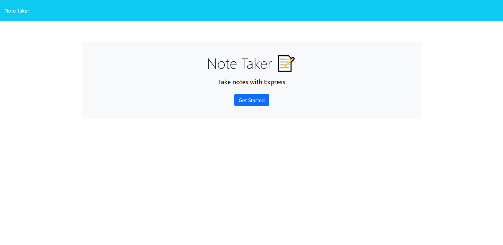
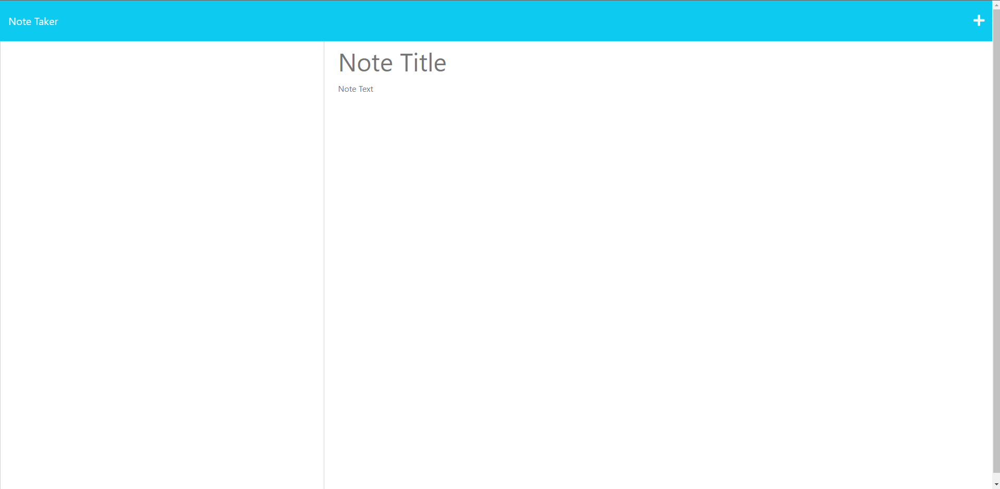
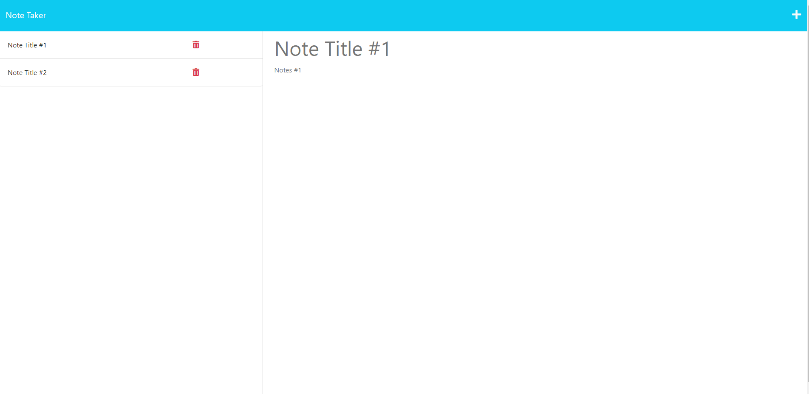

# Martins-Express.js-Challenge-Note-Taker

## Description
This project is to create an application called Note Taker that can be used to write and save notes. This project creates an application where a user can organize my thoughts and keep track of tasks I need to complete. This project allowed me to apply and learn about Express.js back end and how to save and retrieve note data from a JSON file.

## Table of Contents 
- [Description](#description)
- [Web Link](#web-link)
- [Screenshots](#screenshots)
- [Credits](#credits)
- [License](#license)
- [Questions](#questions)

## Web Link

<a href="https://martins-not-taker-5e7f5384cf74.herokuapp.com/notes">Note taker link</a>

## Screenshots

## Credits

Starter Code:
<a href="https://github.com/coding-boot-camp/miniature-eureka">Starter Code Source</a>

## License

None

## Questions

For any additional questions, reach me at <a href="martinapopot@gmail.com">My email</a> or <a href="https://github.com/mardyyy">My github</a>.